# **Multi-return Firmware for Livox LiDAR**

------

[TOC]

# 1.Background

The footprint of the laser beam increases as it gets farther from the LiDAR sensor. This is known as the beam divergence. When the entire beam hits an object, only one single return will be reported. However, in some cases, the laser beam may also hit multiple objects and thus produce multiple returns. Our multi-return firmware is designed to handle such issues. As shown in figure 1, in aerial LiDAR surveys, the last return is used to identify the ground. The other returns come from the tree as the laser beam traverses through all the tree branches. Therefore, the multi-return firmware is more suitable for forestry  applications where the user needs to find the height of the trees.

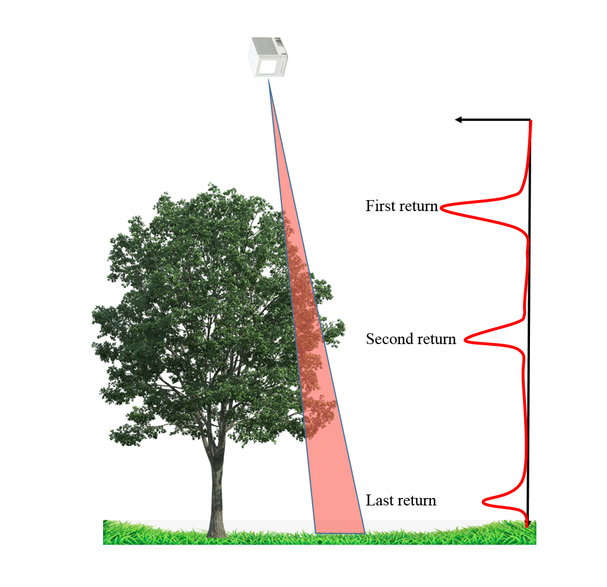

```
Figure 1
```

Another example is shown in figure 2, where the laser beam hits the wall through two pieces of glass. In this instance, a single laser firing results in 3 returns.

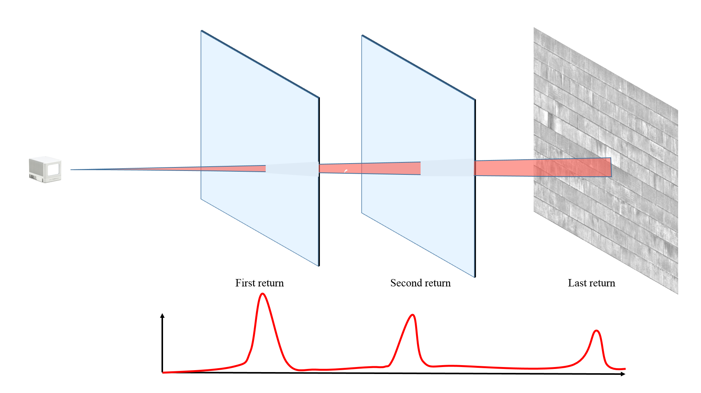

```
Figure 2
```
2. Firmware Info

Double Return Version:

| Name              | LIVOX_MID_FW_03.03.0001.bin      |
| ----------------- | -------------------------------- |
| Version           | v03.03.0001                      |
| Compatible Models | Mid-40/Mid- 100                  |
| MD5               | 424E021858A2521D200FE6D2A422F90A |

Triple Return Version:

| Name              | LIVOX_MID_FW_03.03.0002.bin     |
| ----------------- | ------------------------------- |
| Version           | v03.03.0002                     |
| Compatible Models | Mid-40/Mid- 100                 |
| MD5               | E7B618CE4CC5349F5F0090638F7B04B |


# 3.Characteristics

Due to communication bandwidth limitations, the sampling frequency of multi-return firmware is different from normal firmware shown as below:

| Firmware           | Normal Version | Double Return Version | Triple Return Version |
| ------------------ | :------------: | :-------------------: | :-------------------: |
| Sampling Frequency |     100KHz     |        100KHz         |         60KHz         |
| Point Frequency    |     100KHz     |        200KHz         |        180KHz         |

The packet format of point cloud data of multi-return firmware is different from normal firmware. In order to distinguish the depth between different return calculations, the reflectivity of the first return is the reflectivity value of the object itself, and the reflectivity value of the second return is set to a fixed value of 200 (its color in the Livox Viewer is Orange), the reflectivity value of the third return is set to a fixed value of 250(its color in the Livox Viewer is Red). The header of point cloud data packet (first 11 bytes of the packet)
is the same as normal firmware (refer to the page 9 and 10 of [Livox SDK Communication Protocol](https://www.livoxtech.com/3296f540ecf5458a8829e01cf429798e/downloads/Livox%20SDK%20Communication%20Protocol_EN_20190117.pdf)).

**Double Return Point Cloud Data**

Each packet contains 100 point cloud data, including the first return and the second return of 50 samples. If no multiple returns are detected, the corresponding point data will be set to 0. Timestamp in header of point data packet indicating the time of the first point in the packet. The sampling frequency is 100 KHz, so the time interval of each pulse is 10 us. Point cloud data format is shown as below:

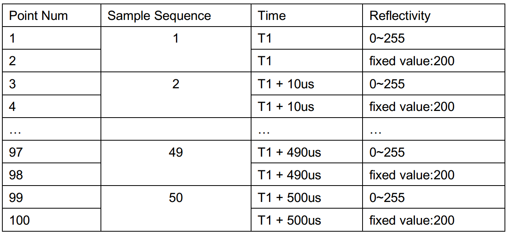

**Triple Return Point Cloud Data:**

Each packet contains 100 point cloud data, including the first return, the second return and the third return of 34 samples. So the 34th sampling have no second return and third return data. If no multiple returns are detected, the corresponding point data will be set to 0. Time stamp indicating the time of the first point in the packet. The sampling frequency is 60 KHz , so the time interval of each pulse is 16.666 us.

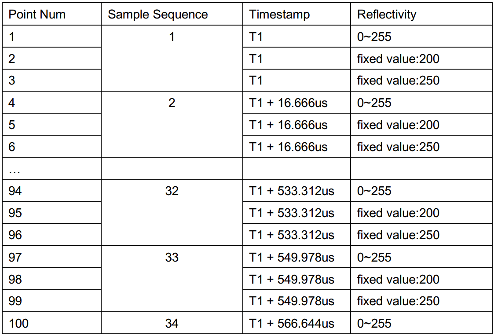

# 4.Effects and Limitations

## 4.1 Effects

For a single laser firing, the normal firmware only reports the first return, while the multi-return firmware can report at most three returns as described above.As shown in figure 3 , 4 below, Livox LiDAR detects from the air to the ground, the normal firmware can only detect the canopy, while the multi-return firmware can detect returns from the ground.

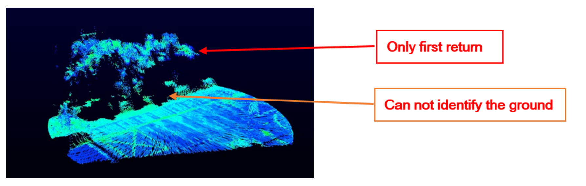

```
Figure 3 using the normal firmware
```
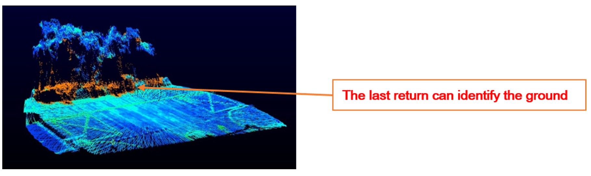

```
Figure 4 using the multi-return firmware(double return version)
```
As shown in figure 5, 6, 7 below, a piece of glass is placed in front of the Livox LiDAR. The normal firmware only calculates the depth of the glass. The multi-return firmware (double return version) can not only calculate the depth of the glass, but also the depth of the wall behind. The multi-return firmware (triple return version)can report additional information of another piece of glass in between.

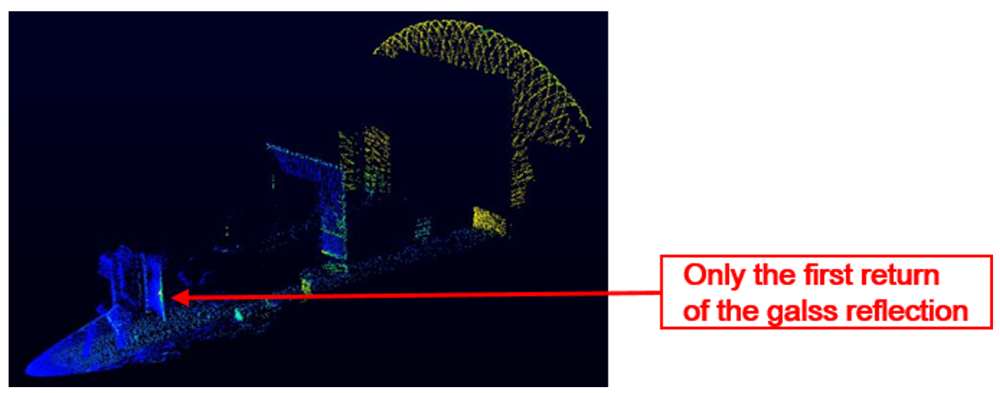

```
Figure 5 using the normal firmware
```
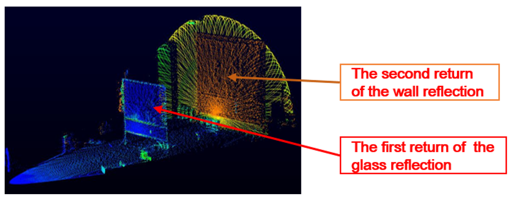

```
Figure 6 using the multi-return firmware(double return version)
```
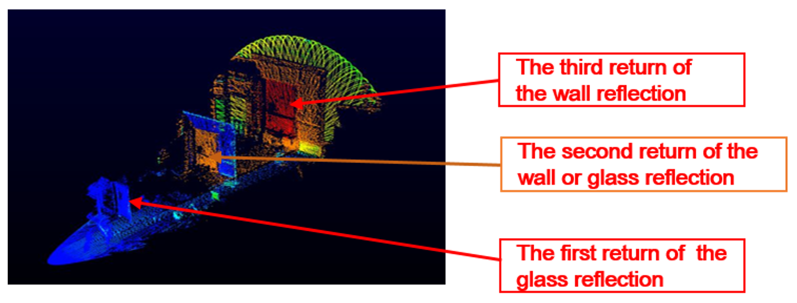

```
Figure 7 using the multi-return firmware(triple return version)
```
## 4.2 Limitations

1. For the multi-return firmware, there will be data redundancy in a clean scene (just one
   return).
2. Multi-return firmware requires a minimum distance gap (typically 2 m) between the consecutive objects in the scene to be scanned. Otherwise, the best results cannot be achieved.
3. Multi-return firmware does not support the rain fog suppression.

# 5.Update Firmware

1. Click ‘Open Device Manager’, a page will appear displaying all detected Livox LiDAR
    sensors. Connect the device you want to upgrade.

    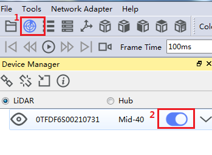

2. Click Tools > Firmware Update.

    

3. Select the Livox LiDAR sensor you wish to update under “Firmware Update” and click “...” to select the firmware.

    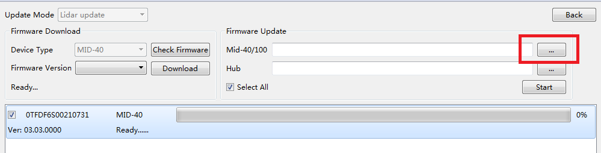

4. Click “Start” to update the firmware of the selected Livox LiDAR sensor.

    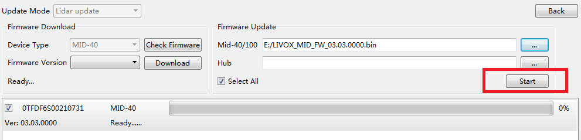

5. The Livox LiDAR sensor will restart and reconnect to the computer after the update. Repeat the steps above if the update fails.

    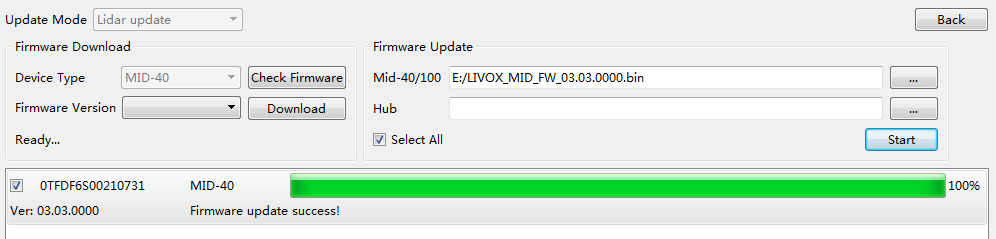