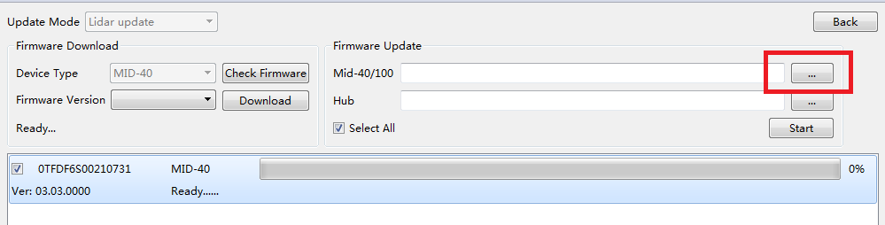

# Special-Firmwares-for-Livox-LiDARs
We offer some special firmwares in this repository.Each special firmware has different characteristics, such as multiple echoes, enhanced denoising capabilities, and so on. We try to be compatible with the Livox SDK, but there may be differences in some of the communication details. Please check the documentation for each special firmware to make sure it is used correctly.Please read the documentation for each firmware carefully to verify that this is the feature you need before upgrading the special firmware.

# Official Q&A site

<https://groups.google.com/forum/#!forum/livox-lidars>

# How to Update Firmware

The normal firmware can be downloaded from Livox Viewer and special firmware can be downloaded from GitHub: <https://github.com/Livox-SDK/Special-Firmwares-for-Livox-LiDARs>. Both normal and special firmware can be updated by Livox Viewer as following steps.
1. Click ‘Open Device Manager’, a page will appear displaying all detected Livox LiDAR
   sensors. Connect the device you want to upgrade.

   

2. Click Tools > Firmware Update.

   

3. Select the Livox LiDAR sensor you wish to update under “Firmware Update” and click “...” to select the firmware.

   

4. Click “Start” to update the firmware of the selected Livox LiDAR sensor.

   

5. The Livox LiDAR sensor will restart and reconnect to the computer after the update. Repeat the steps above if the update fails.

   
