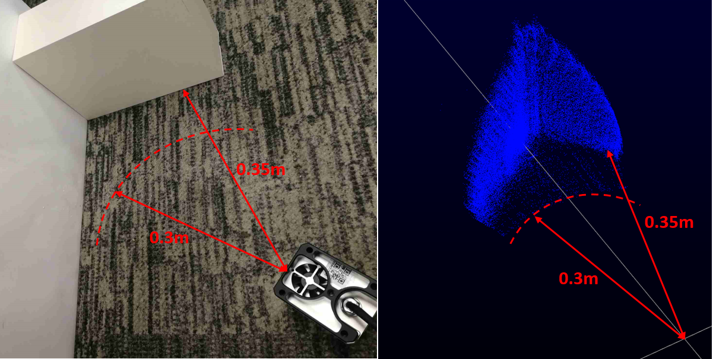

# Short-blind-zone Firmware for Livox LiDAR

[TOC]

## 1. Background

The optical system of LiDAR is usually divided into centered optical system and paraxial optical system. The Livox LiDAR is classified as centered optical system. Since the optical components of the centered optical system itself also reflect the laser, the receiver receives a pulse before the pulse reflected by target object. We call the pulse reflected by the optical components as T0, and the pulse reflected by target object as T1. Typically, because of the arrival time difference between two pulses, T0 and T1 can be easily distinguished, as shown in the figure 1.

**Figure1:** T0 and T1 can be distinguished

However, if the target object is very close to the LiDAR (d is less than a certain distance), like something covering your eyes, the LiDAR can't distinguish T0 and T1, as shown in the figure 2. 

**Figure2:** T0 and T1 are merged

The normal firmware works well only when the target is more than 1m away from the LiDAR. The short blind zone firmware can shorten the distance to 0.3m.

## 2. Firmware Info

| Name              | LIVOX_MID_FW_03.03.0005.bin      |
| ----------------- | -------------------------------- |
| Version           | v03.03.0005                      |
| Compatible Models | Mid-40/Mid- 100                  |
| MD5               | 2EA96AB3EC06A7CA9D0E9D409AB0CF12 |

## 3. Effects and Limitations

### 3.1 Effects

As shown in figure 3, short blind zone firmware can measure obstacles about 0.3m from the LiDAR. However, the normal firmware can't measure anything if something totally cover the FOV (Field Of View) about 1m or less from the LiDAR.

**Figure3:** short blind zone firmware

### 3.2 Limitations

1. When the distance between LiDAR and target object is within 1m, the measurement accuracy will decrease, eapecially the reflectivity of the target object is relatively low.