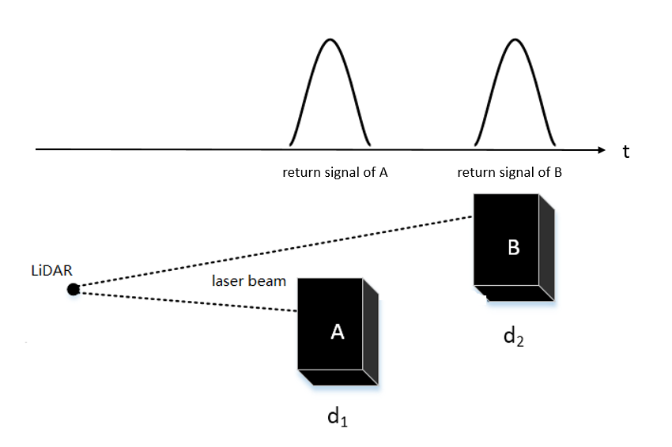
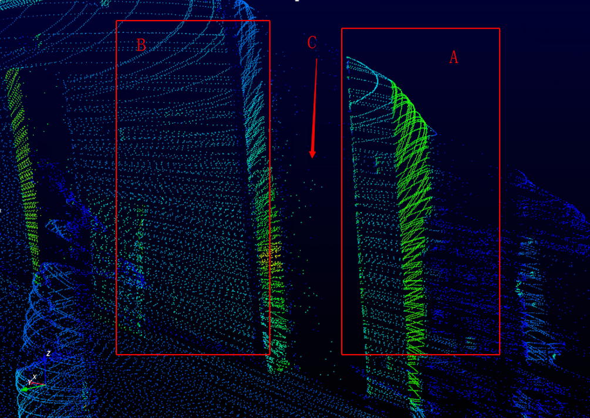
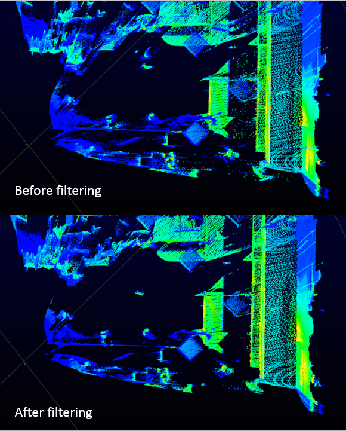
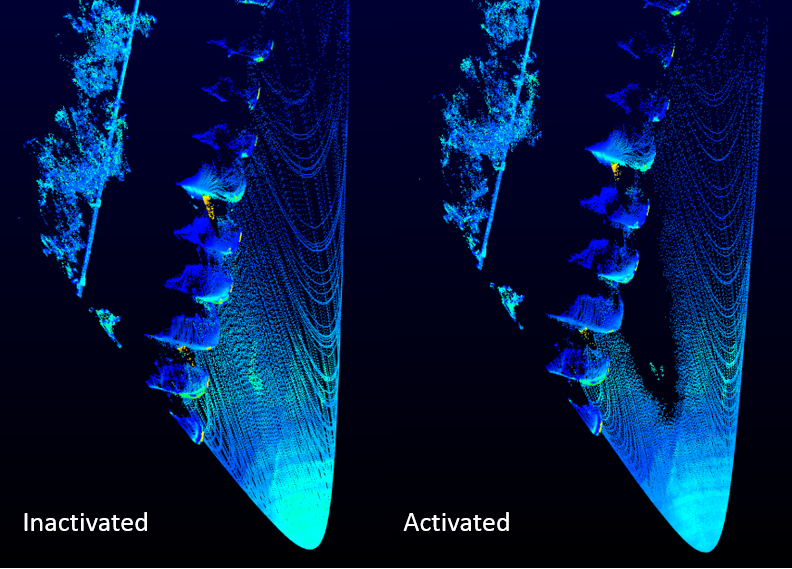

# **Threadlike-Noise Filtering Firmware for Livox LiDAR**

 

[TOC]

 

## 1. Background

Laser beams are confined in a rather narrow cone, but still have a finite diverge angle. As a result, one emitted laser beam might hit multiple objects and cause consecutive return signals.

**Figure 1:** Illustration of multiple returns of one laser beam

Since the return signal itself has a width (typically tens of nanoseconds), the consecutive returns may not always be separated, as shown below:

**Figure 2:** Possible scenarios of two consecutive returns

In case (1), the distance between A and B is large enough so that the two generated returns are separated completely. As for case (2), the distance between A and B is shorter and the two returns are combined, but we can still identify both of them. However, in case (3), when the two objects are very close to each other (e.g. less than 1 m), we can hardly distinguish the combined signal from single return signals.

The misclassified signals in case (3) result in a special/inaccurate depth, normally between A and B, thus causing undesired noise points which look like threads in the displayed point cloud, as shown in Figure 3.

**Figure 3:** An example of noise points caused by combined signals

In this example, A is a pillar in front of a wall B. Because the pillar is very close to the wall, the noise points discussed above appear in zone C, in the middle of A and B.

## 2. Firmware Info

 Threadlike-Noise Filtering Firmware 0.06 (standard version)

| Name              | Threadlike-Noise Filtering Firmware 0.06 |
| ----------------- | ---------------------------------------- |
| Version           | LIVOX_MID_FW_03.03.0003.bin              |
| Compatible Models | Mid-40/Mid-100                           |
| MD5               | 2b0e2a3f8d3be62cf3112ffedce74383         |

 Threadlike-Noise Filtering Firmware 0.02 (strict version)

| Name              | Threadlike-Noise Filtering Firmware 0.02 |
| ----------------- | ---------------------------------------- |
| Version           | LIVOX_MID_FW_03.03.0004.bin              |
| Compatible Models | Mid-40/Mid-100                           |
| MD5               | 7f1bb25c32c5266060f8dc50d5c8e3d2         |

## 3. Characteristic

Two versions of firmware are available to deal with the noise points discussed above. If being identified as noise points, the depth of them will be set to 0.

Version LIVOX_MID_FW_03.03.0004.bin has a stricter standard in distinguishing normal points from noise points, thus may identify more points as noise points. As a side effect, it may filter some points (e.g. the distant ground when you place Livox Mid-40/Mid-100 horizontally at a relatively low height). You can test both and select a suitable version for you.

Feel free to contact us if there is any problem.

The included firmware has no effect on other characteristics such as sampling frequency or data format.

## 4. Effect and Limitation

### 4.1 Effect

Once the noise filtering firmware is activated, the noise points caused by signal combination will be identified and their depths will be set to 0. Below is an indoor example showing the effect:

**Figure 4:** An example of indoor scene before and after filtering

It can be seen that most of the flying noise points are removed by filtering and a much cleaner point cloud is achieved.

### 4.2 Limitation

1. Since our noise filtering strategy is designed and implemented based on particular thread features of the points, it is possible that some normal points may be misidentified as noise points.

   **Figure 5:** Illustration of incorrectly filtered normal points

   

In the example above, some of the ground points are eliminated from the point cloud.
